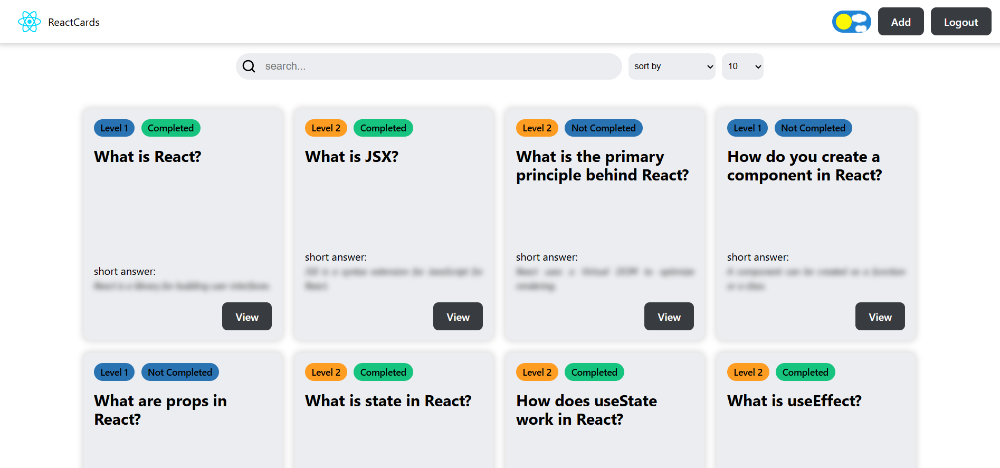

# ⚛️ React Learning Flashcards

An interactive, feature-rich platform designed for mastering React.js core concepts through a structured flashcard system. This Single Page Application (SPA) serves as both a study tool and a demonstration of modern frontend architecture.

## 🚀 Live Demo

👉 https://react-cards-app-qtcz.onrender.com – *(Click to view the live site!)*

---

## 🧩 About the Project

The application provides a dynamic "Question & Answer" interface where users can browse, filter, and manage React-related topics. Each flashcard contains a concise answer, a detailed technical description, and curated external resources for deep diving.

### 🛠️ Technical Achievements & Functionality

- **Full-scale SPA:** Multi-functional application with seamless navigation and modern UI.
- **Advanced Hook Architecture:** Robust logic powered by standard and custom React hooks.
- **Full CRUD Lifecycle:** Integrated Create, Read, Update, and Delete operations (GET, POST, PATCH, DELETE).
- **Intelligent Theming:** Dark and Light mode support with system preference detection.
- **Data Management:** Built-in dynamic filtering, pagination, and sorting for content.
- **Security:** Private Routes for protecting sensitive application areas.
- **Optimization:** Lazy Loading and efficient re-render prevention for a smooth experience.

---

## ⚙️ Technologies Used

- ✅ **React** (Vite, JSX, Virtual DOM)
- ✅ **React Router Dom** (v6, useParams, useLocation)
- ✅ **Custom Hooks** (useFetch, useAuth, useTheme, useLanguage)
- ✅ **State Management** (Context API, useReducer, useState)
- ✅ **CSS Modules** for scoped and scalable styling
- ✅ **React Strict Mode** & **ESLint** for code quality
- ✅ **Responsive Design** principles for mobile-friendly UI

---
