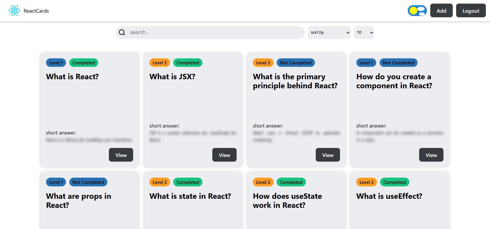

# ⚛️ React Learning Flashcards



An interactive, feature-rich platform designed for mastering React.js core concepts through a structured flashcard system. This Single Page Application (SPA) serves as both a study tool and a demonstration of modern frontend architecture.

## 🚀 Live Demo

👉 https://react-cards-app-qtcz.onrender.com – _(Click to view the live site!)_

---

## 🧩 About the Project

The application provides a dynamic "Question & Answer" interface where users can browse, filter, and manage React-related topics. Each flashcard contains a concise answer, a detailed technical description, and curated external resources for deep diving.

### 🛠️ Technical Achievements & Functionality

- ✅ **JS to TS Migration:** Successfully refactored the entire codebase from JavaScript to TypeScript, implementing strict interfaces to prevent runtime errors and ensure data integrity.

- ✅ **Full CRUD Lifecycle:** Integrated Create, Read, Update, and Delete operations (GET, POST, PATCH, DELETE) with an API.

- ✅ **Security & Auth Guard:** Developed a ProtectedRoutes component to secure private areas of the application and manage user access.

- ✅ **Advanced Hook Architecture:** Authentication and theme-switching logic implemented through professional custom hook patterns.

- ✅ **Intelligent Theming:** Dark and Light mode support with system preference detection and persistent state.

- ✅ **Optimization**: Implemented React.lazy and Suspense for efficient Code Splitting and faster initial page loads (Lazy Loading).

- ✅ **Responsive Design:** A mobile-first, adaptive UI that works seamlessly across all devices and screen sizes.

---

## ⚙️ Technologies Used

- ✅ **TypeScript** — Full type safety for components, hooks, and API data management.

- ✅ **React 18 (Vite, TSX)** — Modern development environment with Strict Mode and optimized build processes.

- ✅ **React Router Dom (v6.4+)** — Dynamic routing, URL parameters (useParams), and protected navigation logic.

- ✅ **Custom Hooks** — Encapsulated logic with reusable hooks like useFetch, useAuth, and useTheme.

- ✅ **State Management** — Centralized app state using Context API and useState for authentication and theming.

- ✅ **CSS Modules** — Scoped, scalable, and maintainable styling for every component.

---

## Folder Structure

```text
src/
├── assets/              # Static assets (images, icons, etc.)
├── auth/                # Authentication logic
│ └── AuthProvider/      # Auth context and provider components
├── components/          # Reusable UI components
│ ├── Badge/
│ ├── Button/
│ ├── Header/
│ ├── Loader/
│ ├── MainLayout/
│ ├── QuestionCard/
│ ├── QuestionCardList/
│ ├── QuestionForm/
│ ├── SearchInput/
│ └── icons.tsx          # Shared icon components/library
├── constants/           # App-wide constants
│ └── global.constants.ts
├── features/            # Complex functional modules
│ └── ThemeToggler/      # Theme switching logic & UI
├── helpers/             # Utility functions
│ ├── dateFormat.ts
│ └── delayFn.ts
├── hooks/               # Custom React hooks
│ ├── useAuth.ts
│ ├── useFetch.ts
│ └── useTheme.ts
├── pages/               # Routed view components
│ ├── AddQuestionPage/
│ ├── EditQuestionPage/
│ ├── ForbiddenPage/
│ ├── HomePage/
│ ├── NotFoundPage/
│ └── QuestionPage/
├── theme/               # Styling configuration & provider
│ ├── index.ts
│ └── ThemeProvider.tsx
├── types/               # Global TypeScript definitions
│ ├── global.enums.ts
│ └── global.types.ts
├── App.tsx              # Main application shell & routing
├── index.css            # Global styles
└── main.tsx             # Application entry point
```

---

### How to run a project locally

Open a terminal and run the command:

#### 1. Cloning a repository

```bash
git clone [https://github.com/AlexandraKurylo/react-app-course](https://github.com/AlexandraKurylo/react-app-course)
```

#### 2. Installing dependencies

```bash
   npm install
```

#### 3. Starting the database (Terminal 1)

```bash
   npm run server
```

#### 4. Launching the application (Terminal 2)

```bash
   npm run dev
```

#### 5. You can run the database and application with one command in one terminal

```bash
   npm run start:app
```
